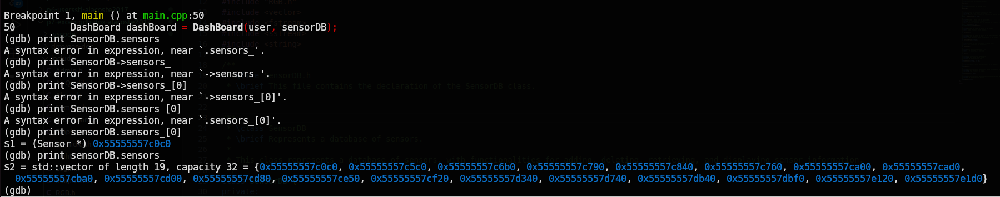
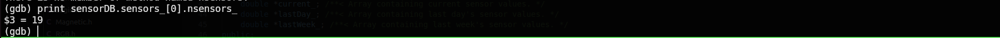
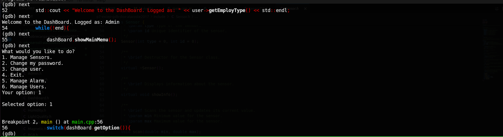
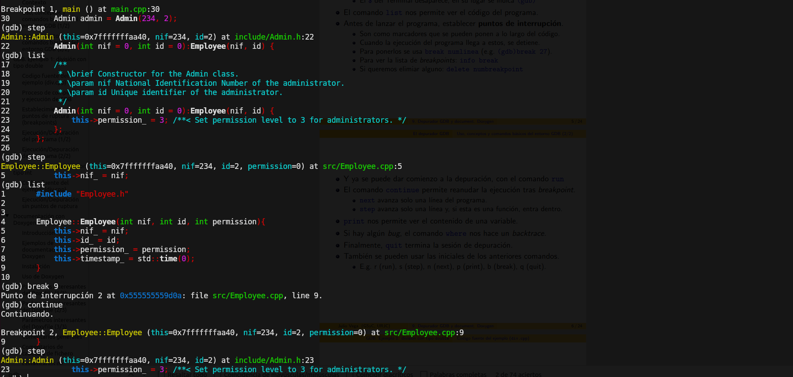

# P7-Excep-GDB-Dox

## Repositorio de entrega de la Práctica 7 de Ampliación De Sistemas Telemáticos

### Inclusión de excepciones:

- **Implementación de la clase propia ValueError**:

He implementado una clase que hereda de excepción para controlar los casos en los que se le pide un número al usuario y este no es válido.

- **Try - catch simples**:

He implementado diferentes try - catch simples; un ejemplo es el caso en el que se le pide al usuario un número y este no es válido.

- **Try - catch anidados**:

Al construir la clase SensorsDB que contiene a los sensores en un set y lee/escribe en un archivo, he implementado diferentes try - catch anidados para controlar distintas excepciones. En concreto, **bad_alloc** por errores de asignación de memoria dinámica, **InvalidArgument** por errores de lectura/escritura en el archivo y **out_of_range** por errores de lectura/escritura en el set. Se pueden ver en el **main.cpp**.

- **Excepción bad_alloc:**

Como expliqué antes, está implementada en el **main.cpp**. Es necesario ya que la cantidad de sensores puede cambiar en tiempo de ejecución y para ello asigno memoria dinámica.

- **Uso de la sentencia Throw {excepction}**:

En el caso de pedirle números al usuario y comprobar si son válidos, lanzo la excepción **ValueError** si no lo son con **Throw**. Se puede encontrar en la función **askForOption()** en el fichero **DashBoard.
cpp**

- **Relanzamiento de excepción**:

Los bloques try - catch anidados del **main.cpp** que recogen las excepciones del constructor de la clase SensorDB están aquí y no dentro del propio constructor. En el propio constructor, cuando ocurre alguna excepción, relanza la excepción y por ello con **throw**, quien se preocupa de recogerla y manejarla es de quien llama al constructor (en este caso el **main**).

### Documentación con Doxygen:

He creado con doxygen un manual documentado de todo el trabajo que llevo hasta el momento. [Aquí](https://github.com/clases-julio/p7-excep-gdb-dox-alacoste2017/blob/main/doxygen-doc/refman.pdf) puedes verlo. He metido el fichero Doxyfile, así como un logo que usa y la documentación en pdf en la carpeta **doxygen-doc**.

### Uso del depurador de GDB:

- **Alguna estructura de almacenamiento:**

Vector de punteros a sensor accedido vía gdb:

- **Algún atributo compartido entre clases que pertenezcan a una jerarquía de herencia:**

Atributo nsensors_ de la clase sensor. Todos los hijos podrán acceder a cuál es el numero total de sensores en la base de datos (actualmente 19)

- **Algún bloque de repetición**:

Un simple bucle while que se encuentra en el main:

- **Algún mecanismo de construcción de objeto que sea instancia de clase hija/nieta en una jerarquía de herencia**:

En la siguiente imagen se podrá ver el constructor de la clase Admin que es hija de Employee. Dicha clase llama al constructor de su padre, es decir, el constructor de Employee y lo que hace es setear los permisos a 3. 

